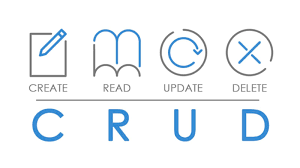

<h4 align="center">
  <br /><br />
  
  <br /><br />
  Uma API CRUD para o cadastro de palestrantes. 
</h4>


<hr />

<details>
  <summary><strong>:rocket: Tecnologias usadas</strong></summary>
  <br />
  
-  MySQL
-  MySQL Workbench
-  Express
-  TDD usando Mocha, Chai, Sinon.
-  Docker
-  ESLint
-  Git
-  VS Code
  
  </details>
  
  <br />

Para rodar a aplicação, irá precisar de: [Git](https://git-scm.com), [VS Code](https://code.visualstudio.com/), [Node.js](https://nodejs.org/) e [NPM](https://www.npmjs.com/).

<br />

Clone o projeto

```bash
  git clone git@github.com:MarcoViana0303/project-talker-manager.git
```

Entre no diretório do projeto

```bash
  cd project-talker-manager
```

Dê um start no docker-compose

```bash
  docker-compose up -d
```

Execute o terminal Bash dentro do container Docker

```bash
 docker exec -it talker-manager bash
```

Instale as dependências

```bash
  npm install
```

## Referência

 - [Documentação - MySQL](https://docs.oracle.com/en-us/iaas/mysql-database/doc/getting-started.html)
 - [Documentação - ExpressJS](https://expressjs.com/pt-br/)
 - [Chat GPT](https://openai.com/blog/chatgpt)

## Feedback

Encontrou algum erro ou está com alguma dúvida? Não deixe de entrar em contato comigo!


## 🔗 Links
[](https://www.linkedin.com/in/marco-viana2022/)
[](https://marcoviana.dev@gmail.com/)
[](https://marcoviana-dev.vercel.app/)
